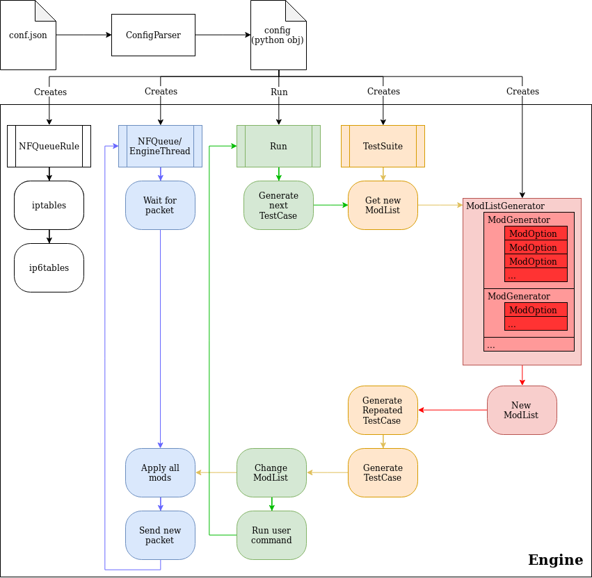

# FragScapy

This project is a command-line tool that can be used to generate
'fragroute-like' tests using Scapy.  
[Fragroute](https://www.monkey.org/~dugsong/fragroute/)'s goal was to
intercept network packets and modify them "on-the-fly" according to the
configuration defined in a config file. So automating tests of different
modifications, requires to kill Fragroute, write a new config file and restart
Fragroute over and over.  
Fragscapy is a rewrite in Python using `fnfqueue` and `scapy` packages that
aims to generate a test suite based on a config file. In a certain way, it
will generates a series of 'fragroute-like' tests and run them consecutively
without having to reload everything. Moreover, the modifications can be
extended by adding some python modules to the project. So instead of fragroute,
the set of possible modifications is not definitive and any modification can be
applied to packets as long one can write them using Scapy.


## Setup

### Building dependencies

The project requires some tools to be installed. Those are:
* git  (for cloning the repository)
* python >= 3.5
* python-dev >= 3.5  (for building the dependencies with pip)
* gcc  (for building the dependencies with pip)
* cffi (for building the dependencies with pip
* make (for simplification of tasks)
* pip  (installed by default in a venv)

The recommended setup is to use a
[virtual environment](https://docs.python.org/3.5/library/venv.html). Once it
is started (or not if using a global installation), the Makefile can do most
of the common tasks.

On Debian or Ubuntu:
```bash
apt install -y git python3 python3-dev gcc python3-cffi-backend make python3-venv
python3 -m venv venv
source venv/bin/activate
```

### Install

To install fragscapy, run:
```bash
make install
```

### Development install

Fragscapy can be installed in development mode. It means the changes made to
the code will be taken into account without the need to rebuild everything
each time:
```bash
make install-dev
```

## Documentation

To build the development documentation, run:
```bash
make build-doc
```
It is then accessible as HTML files under _docs/\_build/_


## Usage

Once installed, there are 3 ways to access fragscapy features:
1. Using the command `fragscapy`. It was installed together with the package.
2. Using the python module directly : `python -m fragscapy`. It is nearly the
    same as using the command except options can be passed to the python
    interpreter.
3. Importing the package in a python interpreter: e.g. ```from fragscapy.mod import ModList```


### Command line options

Run `fragscapy [-h | --help]` for displaying the usage.


### Configuration files

The main way (except if using fragscapy as an imported python package) to
run a test suite is to describe everything in a config file and pass it to the
command line as an argument.  
These config files have a predefined syntax that needs to be respected, else
errors will be thrown.

Examples of possible configuration files and templates can be found under the
[_config\_examples_ directory](config_examples) and the [_config\_common_ directory](config_common).

The command `fragscapy checkconfig` can be used to verify a config file is
valid and understandable. It checks that a maximum of operations will run
without errors (but never runs the command itself).


### Modifications

Various modifications are already available but more can be added. To list
the modifications that are currently detected (and can be used), run
`fragscapy list`. For the details about the options and how to use a specific
modifications, run `fragscapy usage <mod>`.


### Results

At the end of the tests, a summary of the results is displayed based on the
exit code of the command: `0` means the test succeeded and any other value
means the test failed. To adapt any command that does not respect this
convention, one the following can be appended to the command in the
configuration file:
```bash
my_cmd; if [ $? -eq 4 ]; then return 0; else return 1; fi
my_cmd; e=$?; if [ $e -eq 3 ] || [ $e -eq 2 ]; then return 0; else return $e; fi
```


## Adding modifications

Adding a modifications is meant to be as easy as possible: a python module
needs to be added to the _fragscapy/modifications/_ directory and that's all,
it will be detected automatically.  
However, the content of the file needs to respect specific rules to work
correctly:
1. The name of the file should be the name of the modification using
    [snake_case](https://en.wikipedia.org/wiki/Snake_case). It is used to
    import the correct module based on the modification name.
2. The module should define a class whose name is the name of the modification
    using [UpperCamelCase/CapWords](https://en.wikipedia.org/wiki/Camel_case).
    It is used to import the correct object based on the modification name.
3. This class should subclass `fragscapy.modifications.mod.Mod` class. It is
    used to define the default behavior and an interface every modification
    should respect.
4. This class should override the `__init__(self, *args)` method where `args`
    contains a list of strings with the options to create the modification
5. This class should override the `apply(self, pkt_list)` method where
    `pkt_list` is a `PacketList` object that contains the scapy packets to
    modify.
This is all the rules that need to be respected. Anything else (adding other
classes, methods, sumodules, ...) is left to the developer to decide according
to its needs.

The already existing mods can be used as a reference on how to develop a mod
since they all respect these rules too.

## Code architecture

Here is a schema of how the different objects interact together and what they
are doing.


